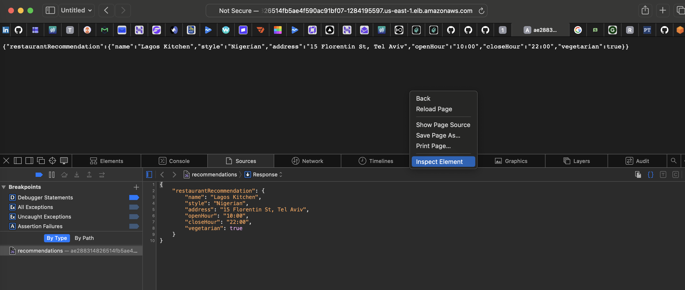
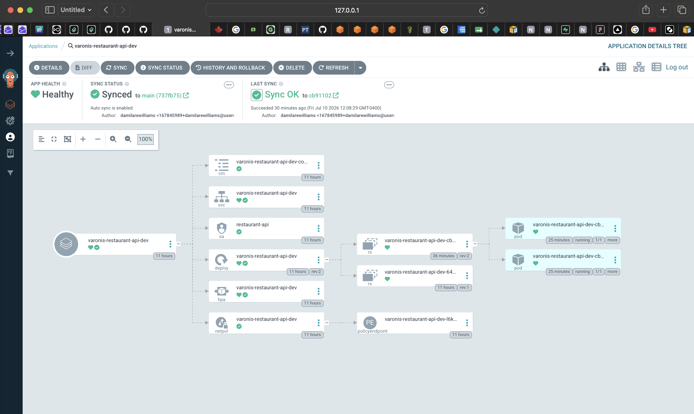
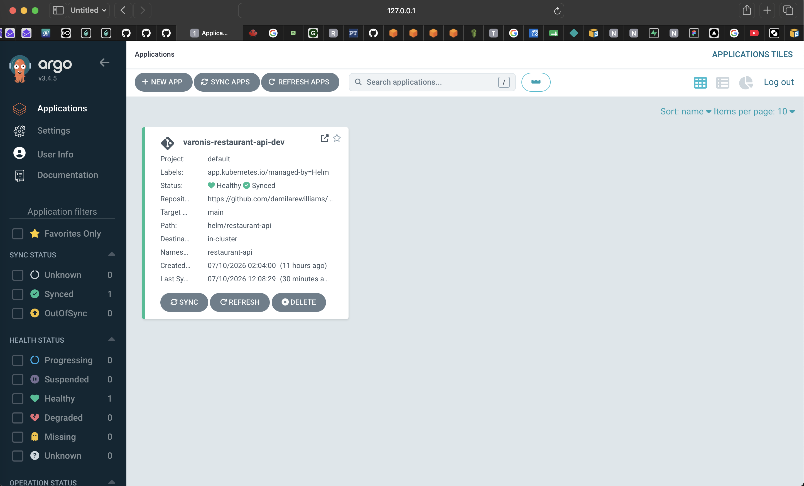
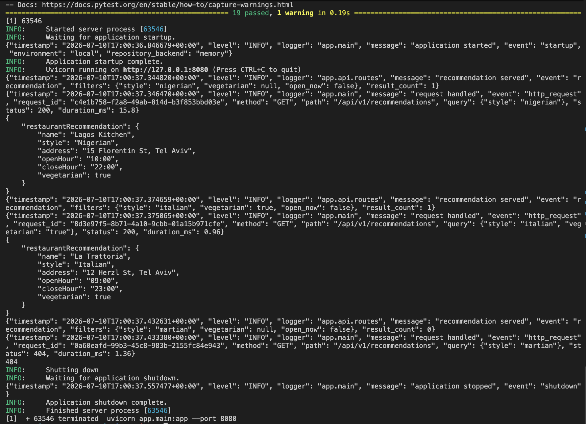
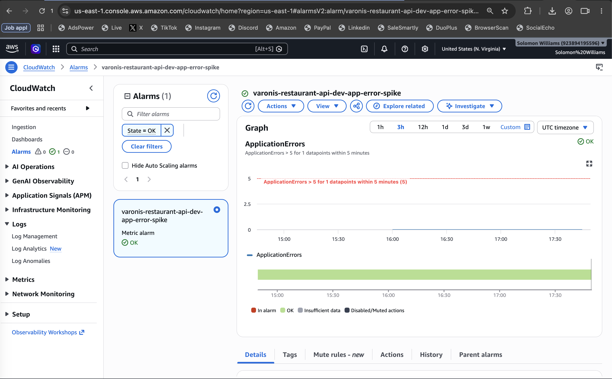
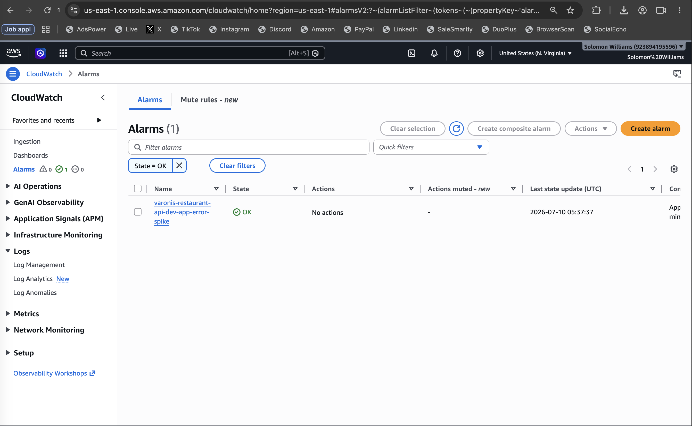
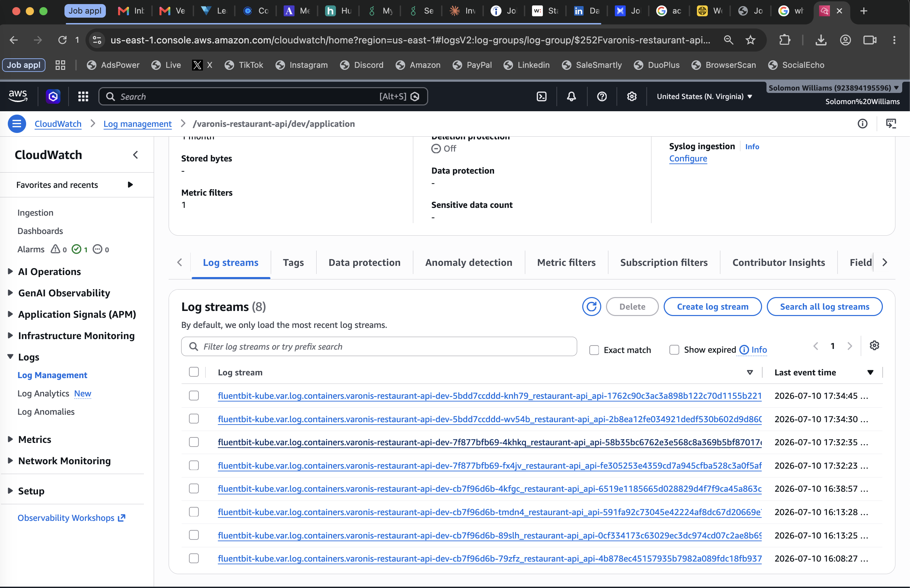

# Varonis Restaurant Recommendation API

Production-grade, cloud-native restaurant recommendation system built to
demonstrate DevOps and Platform Engineering practice: Infrastructure as Code,
GitOps, CI/CD, Kubernetes, and DevSecOps.

## Stack

**App:** Python, FastAPI · **Infra:** Terraform (reusable modules), AWS (VPC,
EKS, ECR, DynamoDB, IAM, KMS, CloudWatch) · **Delivery:** Docker, Helm, ArgoCD,
GitHub Actions, Trivy · **Practices:** GitOps, least-privilege IAM, encrypted
storage, structured logging with sensitive-field masking.

## Architecture

```
GitHub → GitHub Actions → Terraform (plan → approval → apply)
       → Docker build → Trivy scan → push image
       → bump Helm values.yaml → commit → ArgoCD sync → EKS
                                                          └─ FastAPI ─ DynamoDB
                                                          └─ logs ─ CloudWatch
```

Full diagram and rationale: [docs/architecture.md](docs/architecture.md).

## Deployment status

Deployed and verified end-to-end on AWS (account-scoped resources, region
us-east-1): every pipeline stage has run green against the live cluster -
Terraform plan → human approval → apply, image build → Trivy gate → ECR
push → GitOps values bump → ArgoCD sync → in-cluster verification. The API
serves the assignment contract from a KMS-encrypted DynamoDB table via
IRSA (no stored credentials anywhere in the chain).

Try it - the Service is exposed via a public ELB for the review window
(see the submission email for the current hostname, or resolve it with
cluster access):

```bash
curl "http://<elb-hostname>/api/v1/recommendations?style=nigerian"

# with cluster access:
aws eks update-kubeconfig --name varonis-restaurant-api-dev --region us-east-1
kubectl get svc -n restaurant-api varonis-restaurant-api-dev \
  -o jsonpath='{.status.loadBalancer.ingress[0].hostname}'
```

### Verified evidence

| | |
|---|---|
|  | Contract response served over the public internet via the demo ELB |
|  | ArgoCD: `varonis-restaurant-api-dev` Healthy/Synced, auto-sync from `main` |
|  | Resource tree: Deployment, Service, ConfigMap, HPA, NetworkPolicy, 2 pods Running |
|  | Local quickstart: test suite green, contract responses from the in-memory backend - no AWS required |
|  | Structured JSON request logs in CloudWatch, shipped by Fluent Bit with pod metadata |
|  | Application log group encrypted with the customer-managed KMS key |
|  | ERROR-log metric filter and alarm in OK state (threshold: >5 errors in 5 minutes) |

Known gaps, accepted deliberately for the exercise and documented in
[docs/security.md](docs/security.md): no ALB/Ingress controller (access is
port-forward; the chart's Ingress is written but disabled), no
metrics-server (the HPA is declared but cannot read CPU), and hours are
UTC whole-hours (per-restaurant timezones would need a tz field).

**Scope note:** the assignment asks for a recommendation API, IaC, secure
logging, and production-grade practice. This repo deliberately goes
further - EKS/GitOps/ArgoCD, self-hosted CD runners, plan-approval gates,
OIDC-federated CI with zero static AWS keys - to demonstrate platform
thinking, not because the brief demands it. The decision log records what
each layer buys and what a smaller build would have looked like.

## Repository layout

```
.
├── app/          # FastAPI application source
├── terraform/    # IaC: environments/ + reusable modules/
├── helm/         # Helm chart for the API
├── scripts/      # Operational and CI helper scripts
├── tests/        # Application test suite
├── docs/         # Architecture, security, runbooks, decision log
└── .github/      # Workflows, PR template, CODEOWNERS
```

## Quickstart (local, no AWS required)

```bash
python3 -m venv .venv && source .venv/bin/activate
pip install -e ".[dev]"
uvicorn app.main:app --reload --port 8080
curl "localhost:8080/api/v1/recommendations?style=italian&vegetarian=true"
```

## Documentation

| Doc | Contents |
|-----|----------|
| [docs/architecture.md](docs/architecture.md) | Production architecture: AWS, EKS, GitOps, CI/CD, security, logging |
| [docs/api.md](docs/api.md) | Endpoints, parameters, examples, local run |
| [terraform/README.md](terraform/README.md) | Infrastructure: module layout, conventions, remote state |
| [docs/deployment.md](docs/deployment.md) | How deploys happen, rollback, first-time bootstrap |
| [docs/plan-approval.md](docs/plan-approval.md) | CI/CD approval gate: Environments, reviewers, artifact integrity |
| [docs/security.md](docs/security.md) | Every control by layer + accepted trade-offs |
| [docs/monitoring.md](docs/monitoring.md) | Probes, log pipeline, queries, alarms, CD verification |
| [docs/troubleshooting.md](docs/troubleshooting.md) | Symptom-first runbook |
| [docs/teardown.md](docs/teardown.md) | Ordered decommissioning with guardrails |
| [docs/decision-log.md](docs/decision-log.md) | ADR-001–009: every non-obvious decision with alternatives |
| [CONTRIBUTING.md](CONTRIBUTING.md) | Branch workflow, commit and PR conventions |

Per-component detail lives beside the code: each Terraform module and the
Helm chart carry their own README.

## Development workflow

All work happens on feature branches merged into a protected `main` via Pull
Request - one GitHub Issue per branch per PR. See
[CONTRIBUTING.md](CONTRIBUTING.md).
